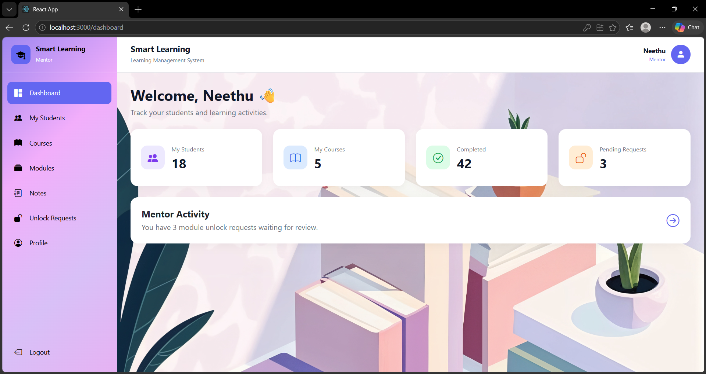
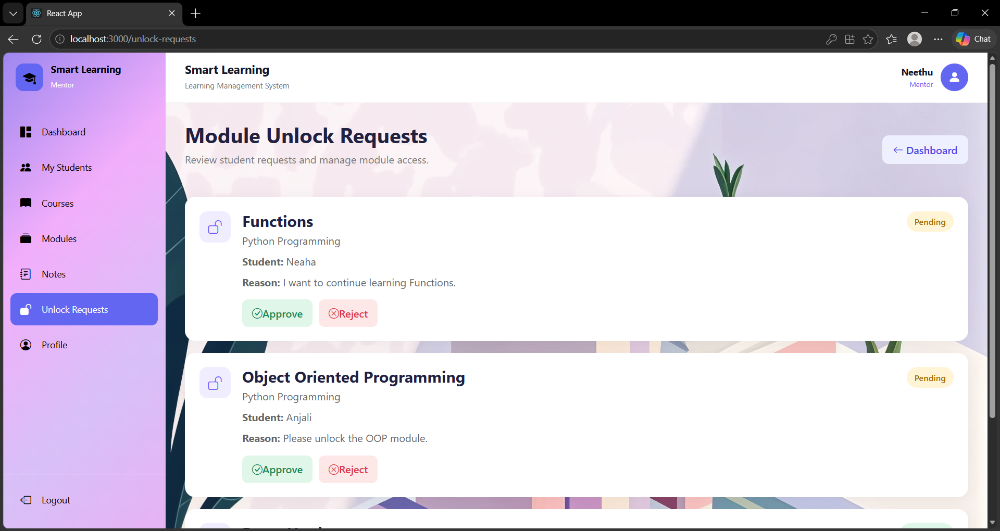
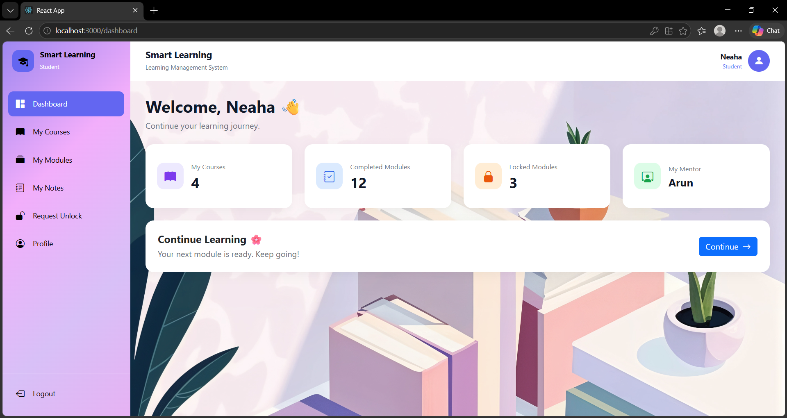
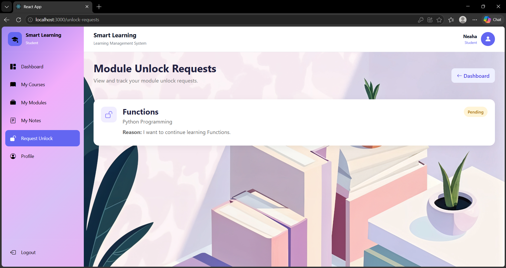

# 💜 Smart Learning Frontend

 

  

  

---

# 🌸 About Smart Learning

**Smart Learning** is a simple and modern learning management frontend designed to provide a smooth learning experience for:

🎓 **Students**

👩🏻‍🏫 **Mentors**

👑 **Administrators**

The application follows a soft **lavender, pastel purple, pink, and cozy study-inspired design**.

The goal is to keep the application easy to understand while still demonstrating a complete learning workflow.

---

# ✨ Main Features

| Feature | Status |
|---|---|
| 🔐 Role-based Login | ✅ |
| 👑 Admin Dashboard | ✅ |
| 👩🏻‍🏫 Mentor Dashboard | ✅ |
| 🎓 Student Dashboard | ✅ |
| 📚 Course Listing | ✅ |
| 🔎 Course Search | ✅ |
| 🏷️ Category Filtering | ✅ |
| 📖 Course Details | ✅ |
| 🧩 Modules | ✅ |
| 📝 Learning Notes | ✅ |
| 🔒 Locked Modules | ✅ |
| 🔓 Module Unlock Requests | ✅ |
| ✅ Approve / Reject Requests | ✅ |
| 📱 Responsive Design | ✅ |
| 📡 Django API Integration | 🔄 |

---

# 👥 User Roles

## 👑 Admin

The Admin interface provides an overview of the learning platform.

📊 Dashboard
📚 Courses
🧩 Modules
📝 Notes
👥 Students
👩🏻‍🏫 Mentors
🔓 Unlock Requests

👩🏻‍🏫 Mentor

The Mentor interface focuses on students and learning management.

📊 Dashboard
👥 My Students
📚 Courses
🧩 Modules
📝 Notes
🔓 Unlock Requests

🎓 Student

The Student interface focuses on learning and course progress.

📊 Dashboard
📚 Courses
🧩 Modules
📝 Notes
🔓 Request Unlock

🌷 Application Flow

                         🔐 LOGIN
                            │
             ┌──────────────┼──────────────┐
             │              │              │
             ▼              ▼              ▼
          👑 ADMIN       👩🏻‍🏫 MENTOR     🎓 STUDENT
             │              │              │
             ▼              ▼              ▼
         DASHBOARD      DASHBOARD      DASHBOARD
             │              │              │
             └──────────────┼──────────────┘
                            │
                            ▼
                       📚 COURSES
                            │
                            ▼
                    📖 COURSE DETAILS
                            │
                            ▼
                         🧩 MODULES
                       ┌────┴────┐
                       │         │
                       ▼         ▼
                    ✅ OPEN    🔒 LOCKED
                       │         │
                       ▼         ▼
                    📝 NOTES   🔓 REQUEST

                
# 📸 Screenshots

## 👑 Admin

### 🔐 Admin Login

  

### 📊 Admin Dashboard

  

### 📚 Admin Management

  

---

## 👩🏻‍🏫 Mentor

### 🔐 Mentor Login

  

### 📊 Mentor Dashboard

  

### 👥 Mentor View

  

---

## 🎓 Student

### 🔐 Student Login

  

### 📊 Student Dashboard

  

### 📚 Student Learning View

  

---
🛠️ Tech Stack

Frontend

  

Tools
 

Libraries Used
⚛️ React
🧭 React Router DOM
📡 Axios
🎨 Bootstrap
✨ Bootstrap Icons
📊 Recharts
---

🐍 Backend

The backend is developed using Django + Django REST Framework.

 

  

🔗 Smart Learning Backend

